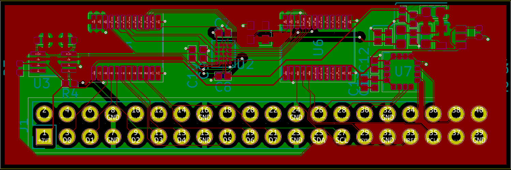
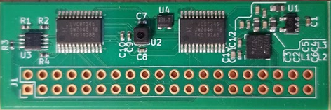

# ICE40-HX8K Camera & IMU Shield

This is an open-source shield designed for Lattice's [ICE-40 breakout board](http://www.latticesemi.com/en/Products/DevelopmentBoardsAndKits/iCE40HX8KBreakoutBoard.aspx) which has a single OV7690 & an IMU. It was developed to experiment with a hardware-accelerated Mono-SLAM algorithm, or other vision applications

As of yet; the verilog library needed to test the design has **not** been written. If a working module is developed, an [ICEStorm](https://github.com/YosysHQ/icestorm) project example will be open sourced and linked here. 

